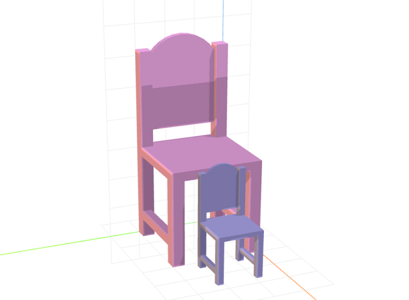

# craft-chair

Parameterized chair model.

### Usage
```html
<craft>
    <craft name="chair" module="craft-chair"/>
    <chair></chair> 
</craft>
```

### Parameters
- legHeight: adjusts height of chair legs
	- default: 14
- length: adjusts length of seat
	- default: 15
- width: adjusts width of seat
	- default: 15

### Example
```html
<craft>
    <craft name="chair" module="craft-chair"/>
    <row spacing="2">
        <chair transform="scale(2,2,2)"></chair>
        <chair></chair>        
    </row>
</craft>
```


